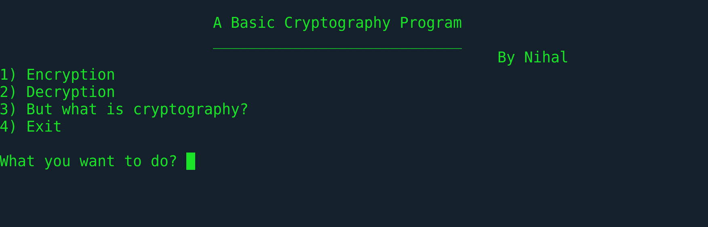

<h1 align="center">
  <br>
  <a href="https://github.com/iamnihal/C_Cryptography"></a>
  <br>
  C Cryptography
  <br>
</h1>

<h4 align="center">Cryptography program witten in C</h4>



#### Intro
A very simple cryptography program written in C. It uses the concept of Caesar Cipher technique which is one of the most simple and famous encryption system in the world of Cryptography.

## How to run?
```
$ git clone https://github.com/iamnihal/C_Cryptography.git
$ cd C_Cryptography
$ cc cryptography.c
$ ./a.out cryptography.c
```
